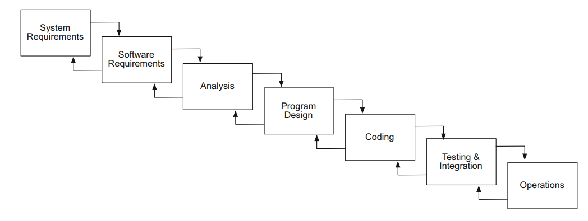
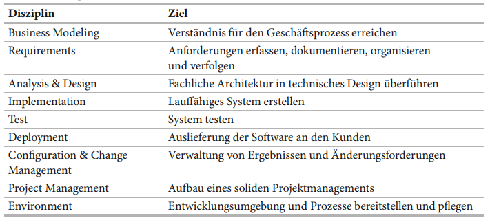

# 5. Vorgehensmodelle in der Softwareentwicklung
### Begrifflichkeiten

**Vorgehensmodell**
Ein Vorgehensmodell beschreibt eine Vorgehensweise, um immer wieder auftretende Aufgaben zu lösen.

**Methode**
Eine Methode ist eine Vorgehensweise zum Lösen eines bestimmten Problems.

**Phase**
Eine Phase beschreibt ein logisch zusammenhängendes Aufgabenfeld.

**Projektfortschrittsstufe**
Die Projektfortschrittsstufe kennzeichnet einen Projektabschnitt und die enthaltenen Aufgaben.

**Tailoring**
Mit Tailoring bezeichnet man das Anpassen eines Vorgehensmodells auf ein Projekt.

## 5.1. Grundsätzliche Vorgehensmodelle
### Phasenmodell
Das bekannteste Phasenmodell ist das Wasserfallmodell. Man startet in der ersten Phase und geht bis zur letzten Phase durch, ein Schritt zurück ist nur bis zu einer Phase möglich, denn das Wasserfallmodell ist dazu gedacht in einem Durchlauf zu enden. Der Name kommt daher, dass die Ergebnisse von einer Phase direkt in die Nächste einfließen. Das Modell eignet sich besser für kleine Projekte da es kein inkrementelles Vorgehen anbietet. Risiken werden spät erkannt und Umplanungen sind nur schwer und kostspielig durchzuführen.

 
### Spiralmodell
Das Spiralmodell ist ein Vorgehensmodell mit iterativem Design. Es besteht aus vier Schritten:
Analyse, Evaluierung, Realisierung, Planung
Bei der Analyse werden Ziele, Anforderungen und Lösungsalternativen festgelegt, in der Evaluierung werden die Lösungsalternativen ausgewertet und Risiken abgeschätzt. Die Realisierung wird geplant und durchgeführt, dann erfolgt das Review und die Planung für den nächsten Iterationsschritt. Im Spiralmodell wird inkrementell vorgegangen und das gesamte Vorgehensmodell wird mit Prototyping unterstützt.

### Prototyping
Im Prototyping geht es um das Darstellen eines Zielsystems oder einer seiner Funktionen, in kleinerer abgespeckter Form. Dabei gibt es verschiedene Faktoren, die je nach Prototyp unterschiedlich stark ausgeprägt sind. Es gibt Prototypen die, die Benutzeroberfläche darstellen, aber keine oder fast keine Funktionen haben und es gibt Prototypen, die nur die Funktionen testen, aber noch gar keine Benutzeroberfläche haben oder eben eine die nicht an das Ziel rankommt. Prototyping ist dazu da sich mit dem Kunden oder den anderen Entwicklern abzusprechen und Missverständnisse auszuschließen. Das Erstellen eines Prototyps ist immer mit Kosten verbunden was man in den Aufwandsschätzungen mit Bedenken muss. Arten von Prototypen sind zum Beispiel:
Demonstratoren, Labormuster, Pilotsysteme, Rapid Prototyping

### Agile Methoden
Neben den Methoden, die sich sehr auf die Planung fokussieren gibt es noch die „agilen“ Methoden, die codeorientierter sind. Agile Praktiken und Methoden sind zum Beispiel:
Refactoring
Der Code wird immer in seiner Lesbarkeit verbessert.
Pair Programming
Zwei Entwickler arbeiten gemeinsam, einer codiert, der Andere führt Reviews durch.
Test-driven Development
Erst werden Tests geschrieben, dann wird Code erstellt, der die Testfälle abdeckt.
Continous Integration
Der Code wird kontinuierlich integriert, so dass Integrationsprobleme sofort erkannt werden.
Planning Game
Die Anwender stellen Anforderungen auf, die Entwickler schätzen den Aufwand.
Agile Methoden haben den Vorteil das sie transparent und sehr dynamisch sind, sie sind dafür sehr schwer vertraglich einzufassen, weil sich der Aufwand vergrößern kann oder weil neue Anforderungen nachträglich hinzugefügt werden können.

## 5.2. Konkrete Vorgehensmodelle
### Scrum
Bei Scrum handelt es sich um ein agiles Vorgehensmodell, alle Teammitglieder können sehr selbständig arbeiten. Es gibt einen Product Owner der das Product Backlog führt. Es enthält alle bisherigen (!) Anforderungen an die Software. In einem sogenannten „Daily-Scrum“, einem Ritual, in dem sich alle Mitarbeiter am Ende des Arbeitstages treffen und sich über ihre Fortschritte und Probleme austauschen, wird das Sprint Backlog erstellt. Es enthält die Anforderungen, die innerhalb eines Sprints durchgeführt werden. Dabei kann ein Sprint bis zu 30 Tagen dauern und hat das Ziel am Ende eine lauffähige Version hervorzubringen. Dieses Release wird dann an den Kunden übergeben, der es bewerten und Zusatz Anforderungen mit einbringen kann, diese werden dann in das Product Backlog geschrieben. Der Scrum Master ist kein Teil des Projektteams und seine Aufgabe besteht darin zu kontrollieren das der Product Owner sich nicht in die Organisation des Projektteams einmischt. Der Scrum Master sollte ein erfahrener Mitarbeiter sein. Bei dem Vorgehensmodell sollten die Teammitglieder erfahren sein und unabhängig coden, testen und refactoren können.

### Rational Unified Process
RUP ist ein aktivitätsgetriebener Entwicklungsprozess, die Aktivitäten sind sehr detailliert vorgegeben. Ihre Reihenfolge und die Arbeitsschritte sind genau definiert. Zum Rational Unified Process gehört die Darstellung der Aufgaben des Projekts in einer Grafik. Auf der x-Achse befinden sich die Phasen und auf der y-Achse die Disziplinen. Durch diese Darstellung entsteht das „Rup-Gebirge“. Der RUP wird üblicherweise durch UML (Use Case Modell) Diagramme unterstützt.
Nachfolgend sind die Phasen und Disziplinen aufgelistet und eine Ansicht des „RUP-Gebirges“.

### V-Modell XT
Das V-Modell XT ist ein Artefakt orientiertes Vorgehensmodell, das heißt es misst den Fortschritt an den Ergebnissen der einzelnen Phasen. Das Modell ist individuell auf das Projekt anpassbar, deshalb ist es so flexibel, dieses Verfahren nennt man „Tailoring“. Es enthält Vorgehens- und Ablaufbausteine und Vorschläge in welchem Zusammenhang diese Bausteine am sinnvollsten sind. Die Pläne richten sich danach aus ob das Modell für den Auftraggeber, Auftragnehmer oder ein eigenständiges Projekt ist. Es kann auch ein Vorgehensmodell mit einbezogenen werden. Im V-Modell XT gibt es keine festgelegten Rollen. Die Rollen werden genauso wir die Vorgehens- und Ablaufbausteine an das Projekt angepasst. Jede Rolle kann als „verantwortlich“ oder als „mitwirkend“ gekennzeichnet werden, ist jemand als Verantwortlicher für ein Produkt zugewiesen, ist es seine Pflicht dafür zu sorgen das das Produkt innerhalb der Kosten und des Zeitrahmens fertig wird, der geforderten Qualität entspricht und das fertige Produkt ordnungsgemäß übergeben wird.
Das Projektmanagement übernimmt die Planung, Überwachung und Steuerung der Produkterstellung. Außerdem kann im Management entschieden werden welche „Managementprodukte“ erstellt werden müssen.

## 5.3. Anpassung von Vorgehensmodellen
Die aufgeführten Vorgehensmodelle sind als Framework zu betrachten, vor allem die grundsätzlichen Vorgehensmodelle werden in der Anwendung verändert und angepasst.

Quellen: 
https://www.integrata.de/leistungsangebot-informationstechnologie/scrum-und-agilitaet/
https://de.wikipedia.org/wiki/Rational_Unified_Process#/media/File:Development-iterative.png
https://www.microtool.de/wissen-online/wie-funktioniert-das-v-modell-xt/#vorgehensbausteine
Projektorganisation und Management im Software Engineering – Manfred Broy, Marco Kuhrmann
